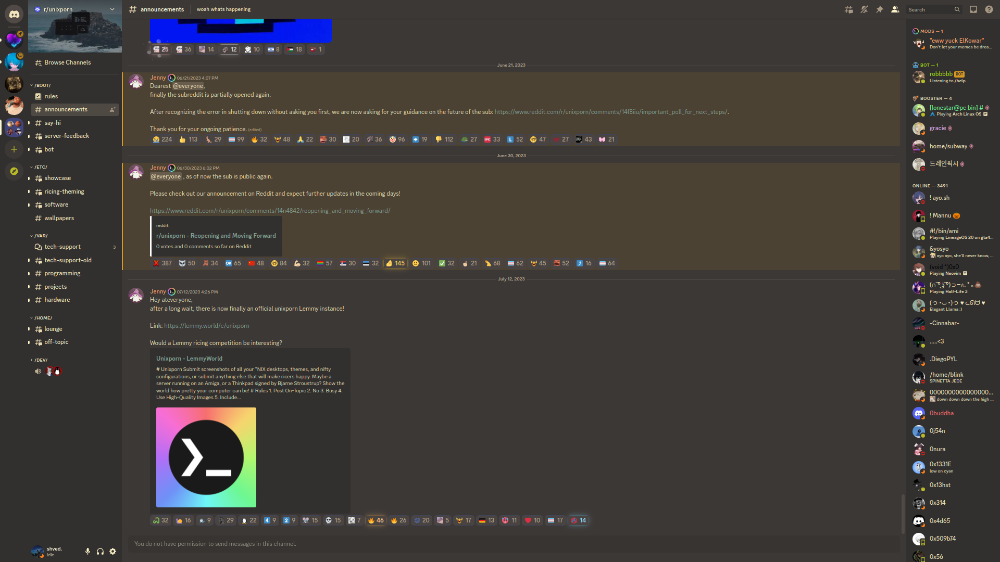
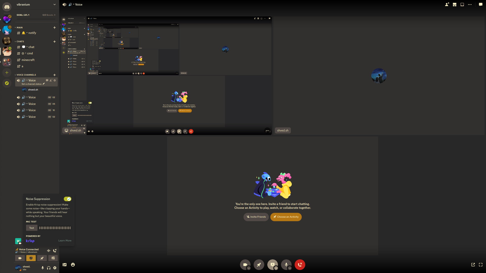
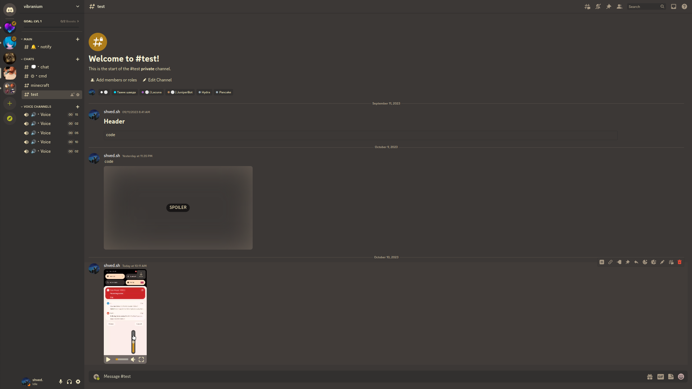
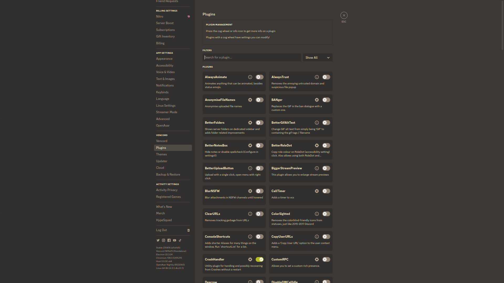
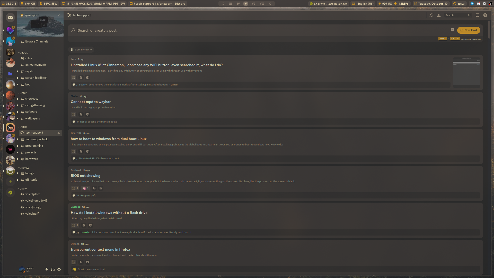
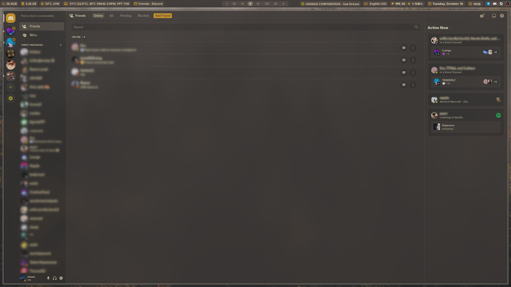

### Gruvbox Material for Discord

|  |  |
| --- | --- |
|  |  |
|  |  |

### Why?

I just love Gruvbox colors and theming everything in my system to this colors. I was surprised that I didn't find any Gruvbox for Discord, so I made my own based on [Catppuccin](https://github.com/catppuccin/discord)

### Problems

Since I don't know css and html at all, I made all the changes "at random", changing parameters and looking for changes. A huge part of the code remains from the [Catppuccin](https://github.com/catppuccin/discord) theme, but I did everything so carefully that these colors are no longer visible. In any case, you can send a PR to fix the desired area. Also, in my opinion, the code is quite cluttered, which could be a problem (probably) for weaker devices
